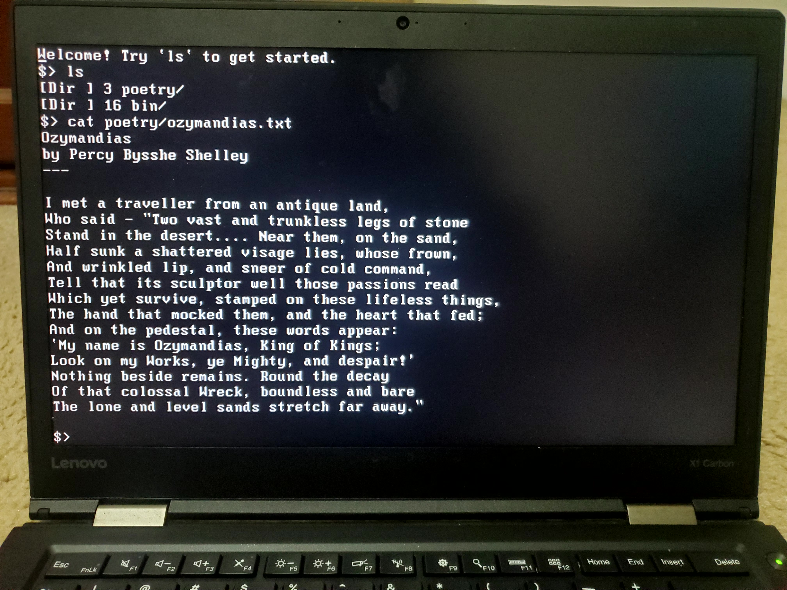

# Foxtail

**Foxtail** is a simple Unix-like 32-bit kernel for x86.
It supports preemptive multitasking, virtual memory, and over 20 syscalls that enable the following features:
- Console and file I/O
- File/directory creation, deletion, and aliasing via symbolic links
- Inter-process communication using pipes
- Dynamic memory allocation
- Process management

The current development build of Foxtail includes a variety of standard user-space utilities.
It is also runnable on real hardware (although you might have to turn on the "Legacy Mode" setting in your BIOS).

  
   
  <em>Foxtail running on a Thinkpad X1 Carbon.</em>

## Building

Currently, the Makefile only works on Linux with Clang.
(GCC should probably work, but I haven't tested it.)
You'll also need `grub-mkrescue` if you want to build a `.iso` file with the GRUB bootloader, and `qemu-system-i386` if you want to test on QEMU.

To build the kernel with existing user-space programs, run `make`, then `make run` to boot the resulting `os.iso` with QEMU, or `make kernel` to boot `kernel.elf` directly using QEMU's kernel image facilities.
If you want to add your own user-space programs, just create the file `user/src/<your_executable_name>.c`, then `make clean` and `make` -- it'll automatically be included in the kernel's filesystem.

## Testing and bug reports

If you find a bug, please open an issue!
I will try my best to get to it as soon as possible.
While I've done some testing, it hasn't been exhaustive at all, so I'm sure there are quite a few bugs I haven't caught yet.
I'd especially appreciate any help testing on real hardware (I don't have many machines to experiment with, so there could be bugs that I've never encountered that might only manifest on specific devices).

## FAQ

- **Why did you implement [feature] using [approach A] instead of [approach B]?**
  A lot of the behavior of Foxtail was inspired by two things: my personal experience with Linux, and my personal experience with xv6 (which we used in my operating systems class).
  However, while I took a lot of high-level architectural ideas from both of these systems, I didn't reference any code or implementation details directly, which is why a lot of things are implemented differently.
  In hindsight, a lot of the implementations can probably be improved or refactored -- this is pretty much just the result of me following my intuition about how things should work.
- **What's next on the roadmap?**
  The two biggest things that are missing right now are a disk driver (the filesystem currently lives entirely in memory) and symmetric multiprocessing.
  After that, I'd like to develop my VGA driver a bit more, which will allow me to use more graphics modes (and maybe even implement a full GUI).
- **Why is it called Foxtail?**
  It's a reference to foxtail millet, a grain which has kernels.
  I'm not good at thinking of names.
- **Can it run Doom?**
  ... stay tuned.
- **Can it run League of Legends?**
  No.
